# 📚 Online Bookstore Management System

A full-stack web application for managing an online bookstore with comprehensive features for both administrators and customers. Built with ASP.NET Core Web API, React, and SQL Server.

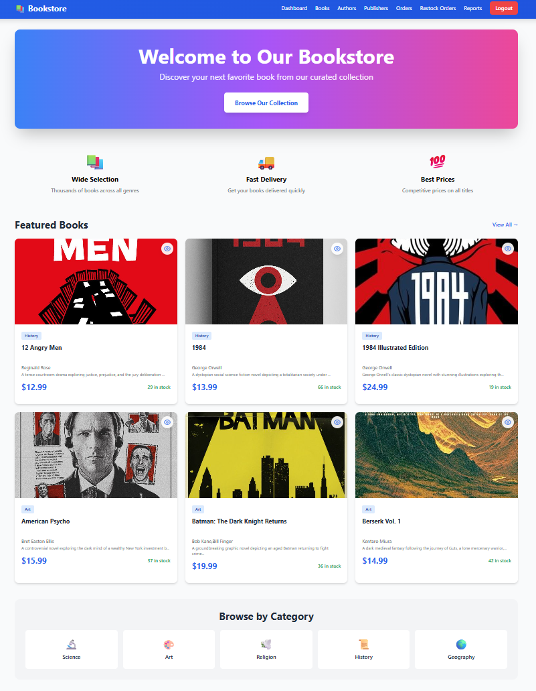

---

## 📋 Table of Contents

- [Project Overview](#project-overview)
- [Technology Stack](#technology-stack)
- [Architecture](#architecture)
- [Database Design](#database-design)
- [Features](#features)
- [Installation & Setup](#installation-setup)
- [API Documentation](#api-documentation)

---

## 🎯 Project Overview

<a id="project-overview"></a>

The Online Bookstore Management System is a comprehensive e-commerce platform designed to manage book inventory, customer orders, and publisher relationships. The system supports two user roles:

- **Administrators**: Manage books, authors, publishers, inventory, orders, and generate reports
- **Customers**: Browse books, manage shopping cart, place orders, and track purchase history

---

## 💻 Technology Stack

<a id="technology-stack"></a>

### Backend

- **Framework**: ASP.NET Core 9.0 Web API
- **Architecture**: Clean Architecture with Repository Pattern
- **Database**: SQL Server 2022
- **ORM**: Dapper
- **Authentication**: Session-based authentication

### Frontend

- **Framework**: React 18.3
- **UI Library**: Tailwind CSS 3.3
- **Routing**: React Router DOM 6.20
- **State Management**: Context API (AuthContext, CartContext)
- **Form Handling**: Formik 2.4 + Yup validation
- **HTTP Client**: Axios 1.6
- **Charts**: Recharts 2.10
- **Icons**: React Icons 4.12
- **Notifications**: React Hot Toast 2.4

### Database

- **DBMS**: Microsoft SQL Server
- **Design**: Normalized to 3NF
- **Triggers**: Automated inventory management and order processing

---

## 🏗️ Architecture

<a id="architecture"></a>

### Backend Architecture - Clean Architecture

```
OnlineBookStoreApi/
│
├── API Layer (Presentation)
│   ├── Controllers/
│   │   ├── AuthorController.cs
│   │   ├── BookController.cs
│   │   ├── OrderController.cs
│   │   ├── PublisherController.cs
│   │   ├── PublisherOrderController.cs
│   │   ├── ReportController.cs
│   │   ├── ShoppingCartController.cs
│   │   └── UserController.cs
│   └── Program.cs
│
├── Application Layer (Business Logic)
│   ├── Services/
│   │   ├── AuthorService.cs
│   │   ├── BookService.cs
│   │   ├── OrderService.cs
│   │   ├── PublisherService.cs
│   │   ├── PublisherOrderService.cs
│   │   ├── ReportService.cs
│   │   ├── ShoppingCartService.cs
│   │   └── UserService.cs
│   └── DTOs/
│       ├── AuthorDto/
│       ├── BookDto/
│       ├── CartDto/
│       ├── OrderDto/
│       ├── PublisherDto/
│       ├── PublisherOrderDto/
│       ├── ReportDto/
│       └── UserDto/
│
└── Infrastructure Layer (Data Access)
    ├── Repositories/
    │   ├── AuthorRepository.cs
    │   ├── BookRepository.cs
    │   ├── OrderRepository.cs
    │   ├── PublisherRepository.cs
    │   ├── PublisherOrderRepository.cs
    │   ├── ReportRepository.cs
    │   ├── ShoppingCartRepository.cs
    │   └── UserRepository.cs
    └── Data/
        └── DatabaseConnection.cs
```

#### Design Patterns Used

1. **Repository Pattern**: Abstracts data access logic
2. **Dependency Injection**: Loose coupling between layers
3. **DTO Pattern**: Data transfer between layers
4. **Service Layer Pattern**: Business logic separation

### Frontend Architecture

```
bookstore-frontend/
│
├── public/
├── src/
│   ├── api/                    # API integration layer
│   │   ├── axiosConfig.js
│   │   ├── authorApi.js
│   │   ├── bookApi.js
│   │   ├── cartApi.js
│   │   ├── orderApi.js
│   │   ├── publisherApi.js
│   │   ├── publisherOrderApi.js
│   │   ├── reportApi.js
│   │   └── userApi.js
│   │
│   ├── components/
│   │   ├── Admin/              # Admin dashboard & management
│   │   │   ├── Dashboard.jsx
│   │   │   ├── BookManagement.jsx
│   │   │   ├── AuthorManagement.jsx
│   │   │   ├── PublisherManagement.jsx
│   │   │   ├── OrderManagement.jsx
│   │   │   ├── PublisherOrderManagement.jsx
│   │   │   └── Reports.jsx
│   │   │
│   │   ├── Customer/           # Customer-facing pages
│   │   │   ├── HomePage.jsx
│   │   │   ├── ShopPage.jsx
│   │   │   ├── BookCard.jsx
│   │   │   ├── BookDetailModal.jsx
│   │   │   ├── CartPage.jsx
│   │   │   ├── CheckoutPage.jsx
│   │   │   ├── MyOrdersPage.jsx
│   │   │   └── ProfilePage.jsx
│   │   │
│   │   ├── Auth/               # Authentication
│   │   │   ├── LoginPage.jsx
│   │   │   └── RegisterPage.jsx
│   │   │
│   │   ├── Layout/             # Layout components
│   │   │   ├── Navbar.jsx
│   │   │   └── ProtectedRoute.jsx
│   │   │
│   │   └── Common/             # Shared components
│   │       └── LoadingSpinner.jsx
│   │
│   ├── context/                # Global state management
│   │   ├── AuthContext.jsx
│   │   └── CartContext.jsx
│   │
│   ├── App.jsx
│   ├── index.js
│   └── index.css
│
├── package.json
└── tailwind.config.js
```

---

## 🗄️ Database Design

<a id="database-design"></a>

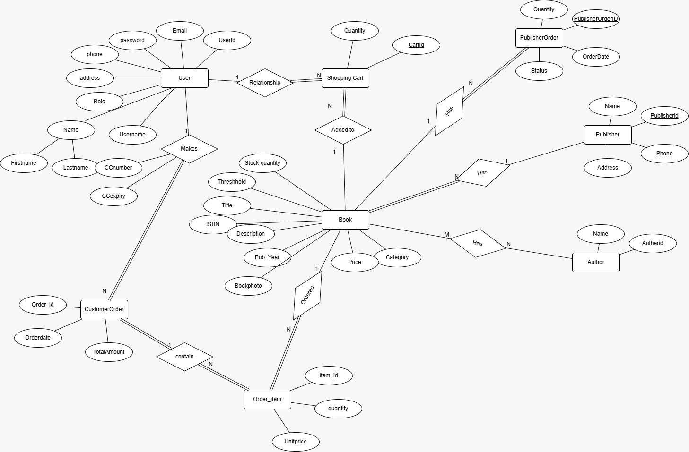

### Entity Relationship Model

The database follows a normalized relational design (3NF) with the following entities:
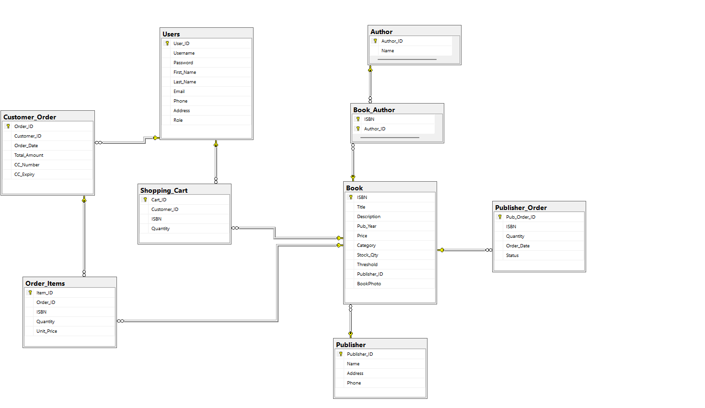

#### Core Entities

1. **Users** - Customer and Admin accounts
2. **Book** - Book catalog with details
3. **Author** - Author information
4. **Publisher** - Publisher details
5. **Book_Author** - Many-to-many relationship between books and authors
6. **Customer_Order** - Customer purchase orders
7. **Order_Items** - Items within each order
8. **Shopping_Cart** - Customer shopping cart items
9. **Publisher_Order** - Inventory replenishment orders

### Database Schema

```sql
-- Users Table
CREATE TABLE Users (
    User_ID INT IDENTITY(1,1) PRIMARY KEY,
    Username VARCHAR(50) UNIQUE NOT NULL,
    Password VARCHAR(50) NOT NULL,
    First_Name VARCHAR(50),
    Last_Name VARCHAR(50),
    Email VARCHAR(100),
    Phone VARCHAR(20),
    Address VARCHAR(255),
    Role VARCHAR(10) CHECK (Role IN ('Admin', 'Customer'))
);

-- Book Table
CREATE TABLE Book (
    ISBN VARCHAR(20) PRIMARY KEY,
    Title VARCHAR(200) NOT NULL,
    Description NVARCHAR(MAX),
    Pub_Year INT,
    Price DECIMAL(10, 2) NOT NULL,
    Category VARCHAR(50) CHECK (Category IN ('Science', 'Art', 'Religion', 'History', 'Geography')),
    Stock_Qty INT NOT NULL DEFAULT 0,
    Threshold INT NOT NULL DEFAULT 10,
    Publisher_ID INT NOT NULL,
    BookPhoto VARBINARY(MAX),
    FOREIGN KEY (Publisher_ID) REFERENCES Publisher(Publisher_ID)
);

-- ... (Other tables as per schema)
```

### Database Triggers

#### 1. Prevent Negative Stock

```sql
CREATE TRIGGER TR_Book_PreventNegativeStock
ON Book AFTER UPDATE
AS BEGIN
    IF EXISTS (SELECT 1 FROM INSERTED WHERE Stock_Qty < 0)
    BEGIN
        RAISERROR('Error: Stock quantity cannot be negative.', 16, 1);
        ROLLBACK TRANSACTION;
    END
END;
```

#### 2. Auto-Restock When Below Threshold

```sql
CREATE TRIGGER TR_Book_AutoRestock
ON Book AFTER UPDATE
AS BEGIN
    IF UPDATE(Stock_Qty)
    BEGIN
        INSERT INTO Publisher_Order (ISBN, Quantity, Status)
        SELECT ISBN, 50, 'Pending'
        FROM INSERTED I
        INNER JOIN DELETED D ON I.ISBN = D.ISBN
        WHERE D.Stock_Qty >= I.Threshold AND I.Stock_Qty < I.Threshold;
    END
END;
```

#### 3. Confirm Publisher Order & Update Stock

```sql
CREATE TRIGGER TR_PubOrder_Confirm
ON Publisher_Order AFTER UPDATE
AS BEGIN
    IF UPDATE(Status)
    BEGIN
        UPDATE B
        SET Stock_Qty = B.Stock_Qty + I.Quantity
        FROM Book B
        INNER JOIN INSERTED I ON B.ISBN = I.ISBN
        WHERE I.Status = 'Confirmed' AND D.Status <> 'Confirmed';
    END
END;
```

#### 4. Deduct Stock on Customer Purchase

```sql
CREATE TRIGGER TR_OrderItems_DeductStock
ON Order_Items AFTER INSERT
AS BEGIN
    UPDATE B
    SET Stock_Qty = B.Stock_Qty - I.Quantity
    FROM Book B
    INNER JOIN INSERTED I ON B.ISBN = I.ISBN;
END;
```

---

## ✨ Features

<a id="features"></a>

### 👤 User Management

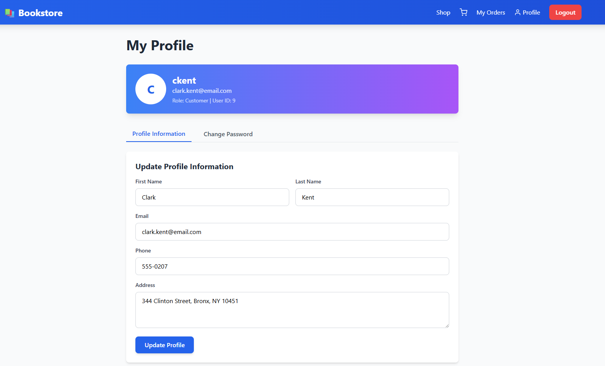

#### Customer Features

- ✅ User registration with validation
- ✅ Secure login/logout
- ✅ Profile management (edit personal info)
- ✅ Password change functionality
- ✅ View purchase history with details

#### Admin Features

- ✅ Full access to management dashboards
- ✅ Generate comprehensive reports
- ✅ Manage inventory and orders

---

### 📖 Book Management (Admin Only)

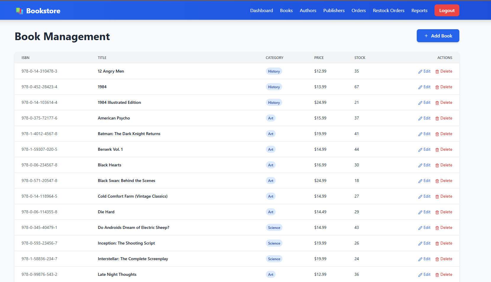

- ✅ **Add New Books**

  - Input ISBN, title, description, category
  - Set price, stock quantity, and threshold
  - Upload book cover image (JPG/PNG/WEBP, max 5MB)
  - Assign multiple authors via checkbox selection
  - Select publisher from dropdown

- ✅ **Edit Existing Books**
  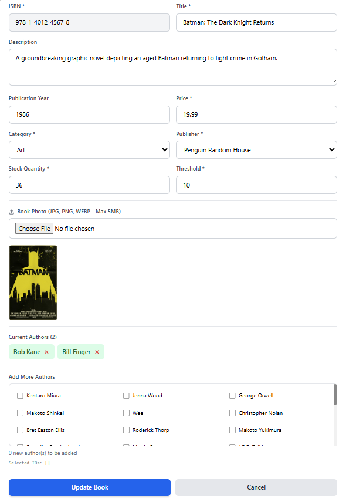

  - Update all book information
  - Change book cover photo
  - Manage author assignments
  - View current authors with remove option
  - Add new authors (only unassigned authors shown)

- ✅ **Delete Books**

  - Remove books from inventory
  - Cascade deletion of related records

- ✅ **Smart Author Assignment**

  - Shows only unassigned authors when editing
  - Display current authors with remove buttons
  - Prevent duplicate author assignments

- ✅ **Book Photo Management**
  - Upload/update book cover images
  - Image validation (size and type)
  - Preview before saving

---

### ✍️ Author Management (Admin Only)

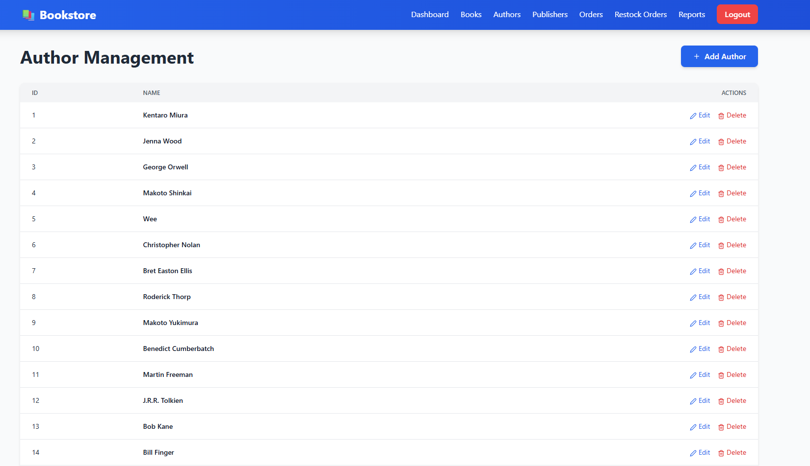

- ✅ Add new authors
- ✅ Edit author information
- ✅ Delete authors (with validation)
- ✅ View all authors in table format

---

### 🏢 Publisher Management (Admin Only)

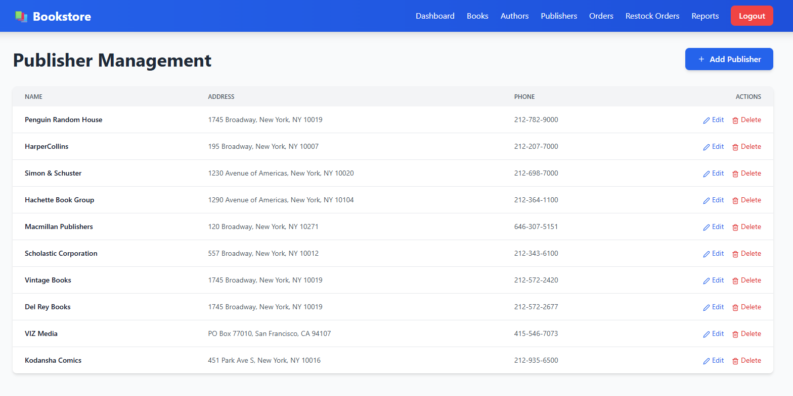

- ✅ Add new publishers with contact details
- ✅ Edit publisher information
- ✅ Delete publishers
- ✅ View complete publisher directory

---

### 🛒 Shopping & Cart

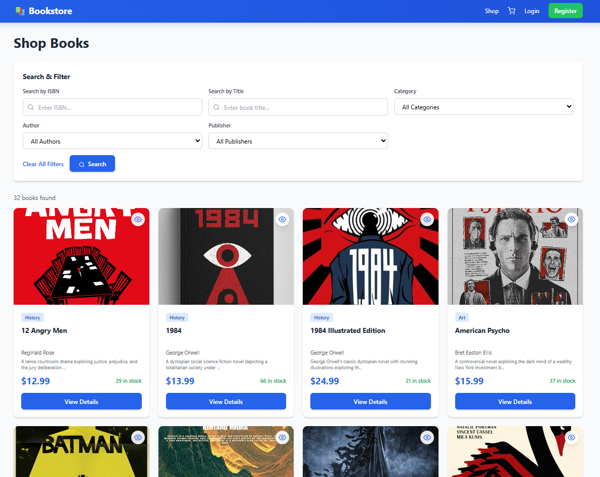

#### Browse & Search

- ✅ **Advanced Search Functionality**

  - Search by ISBN
  - Search by title
  - Filter by category (Science, Art, Religion, History, Geography)
  - Filter by author
  - Filter by publisher
  - Multi-filter combination
  - Debounced search (500ms)
  - Real-time results

- ✅ **Book Display**

  - Grid layout with book cards
  - Book cover images
  - Price and stock status
  - Category badges
  - Author information
  - Description preview

- ✅ **Book Detail Modal**
  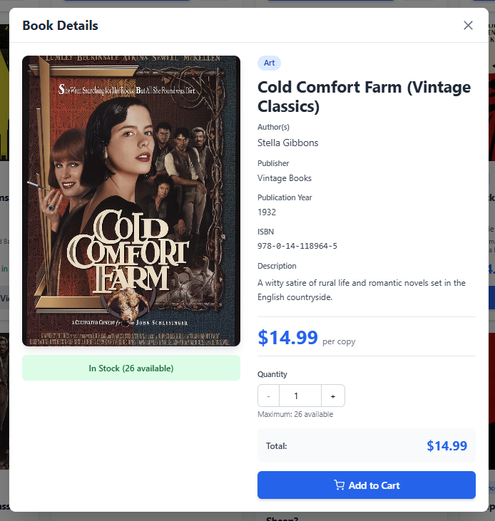

  - Click any book card to view full details
  - Large book cover image
  - Complete description
  - All metadata (authors, publisher, year, ISBN)
  - Color-coded stock status:
    - 🟢 Green: In Stock (>10 copies)
    - 🟡 Yellow: Low Stock (1-10 copies)
    - 🔴 Red: Out of Stock
  - Quantity selector with validation
  - Real-time total price calculation
  - Add to cart with chosen quantity

#### Shopping Cart Management

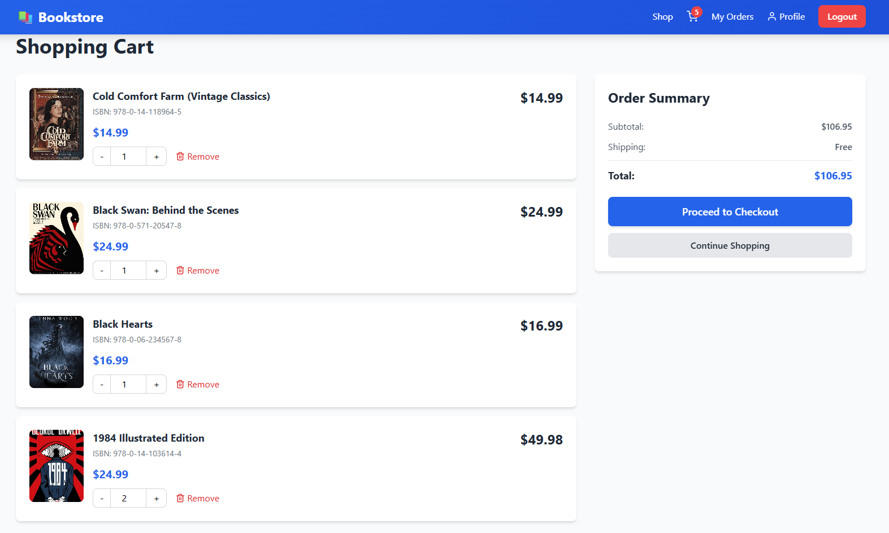

- ✅ **Cart Operations**

  - Add books to cart (single or multiple copies)
  - Update quantity with +/- buttons or direct input
  - Remove items from cart
  - View individual and total prices
  - Stock availability check
  - Cart counter in navigation

- ✅ **Cart Persistence**
  - Cart saved to database
  - Persists across sessions
  - Automatic cleanup on logout

---

### 💳 Checkout & Orders

#### Checkout Process

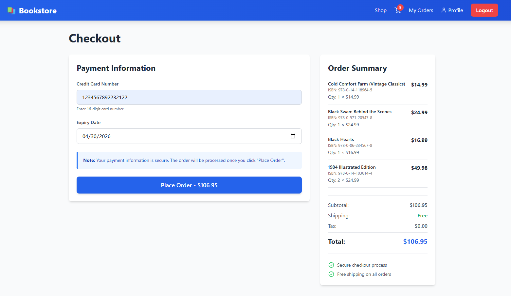

- ✅ Credit card information input
- ✅ Card validation (16 digits, expiry date)
- ✅ Order summary with item breakdown
- ✅ Total price calculation
- ✅ Free shipping
- ✅ Secure payment processing

#### Order Confirmation

- ✅ Automatic stock deduction
- ✅ Order ID generation
- ✅ Email confirmation (conceptual)
- ✅ Cart cleared after successful order
- ✅ Redirect to order history

#### Order History

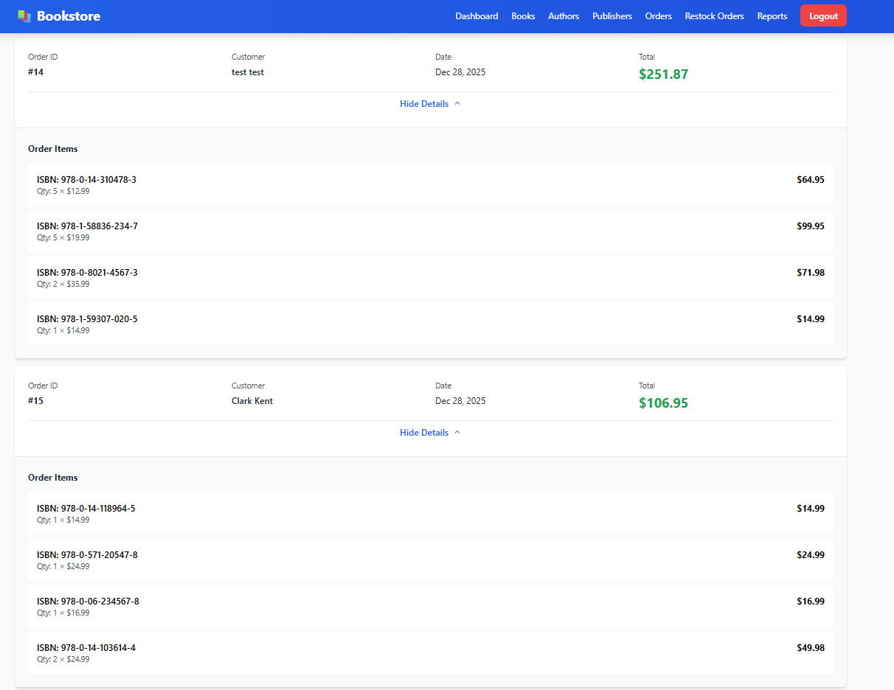

- ✅ View all past orders
- ✅ Order details with items
- ✅ Order date and total amount
- ✅ Expandable order items view
- ✅ Order status tracking

---

### 📦 Inventory Management (Admin Only)

#### Stock Monitoring

- ✅ Real-time stock levels
- ✅ Low stock alerts (red indicator)
- ✅ Threshold-based monitoring
- ✅ Automatic restock triggering

#### Publisher Orders

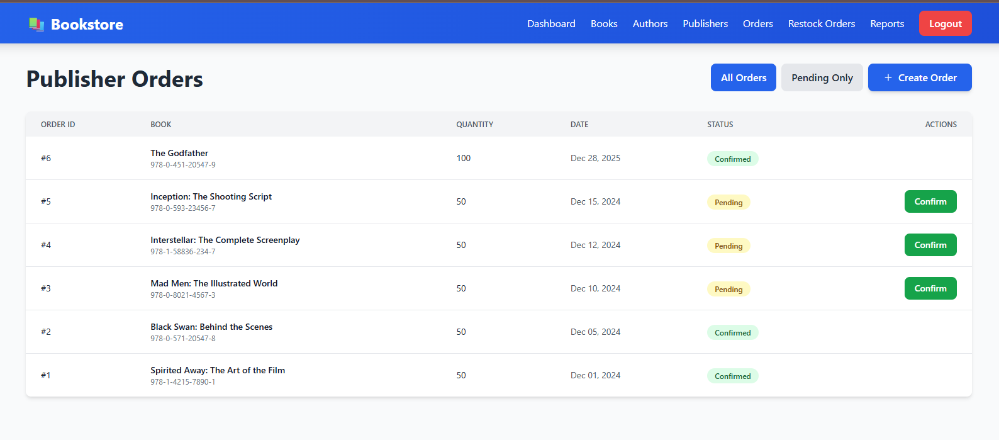

- ✅ **Automatic Order Creation**

  - Triggered when stock falls below threshold
  - Fixed quantity (50 units)
  - Pending status by default

- ✅ **Order Management**

  - View all publisher orders
  - Filter pending orders
  - Confirm orders when stock received
  - Automatic stock update on confirmation

- ✅ **Manual Order Creation**
  - Create custom publisher orders
  - Specify ISBN and quantity
  - Track order date and status

---

### 📊 Reports & Analytics (Admin Only)

#### Admin Dashboard

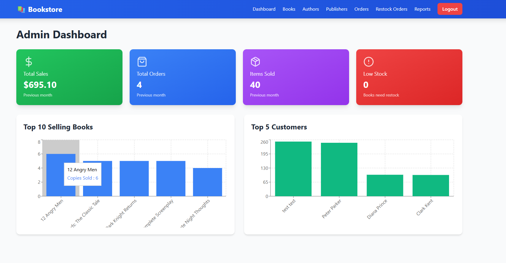

- ✅ **Key Metrics Cards**

  - Total sales (previous month)
  - Total orders (previous month)
  - Items sold (previous month)
  - Low stock count

- ✅ **Visual Charts**

  - Top 10 selling books (bar chart)
  - Top 5 customers (bar chart)
  - Interactive hover effects

- ✅ **Low Stock Alert Section**
  - Books below threshold
  - Visual cards with stock levels
  - Quick reference for restocking

#### Sales Reports

- ✅ **Previous Month Sales**

  - Total revenue
  - Number of orders
  - Items sold

- ✅ **Sales by Specific Date**
  - Date picker
  - Daily sales breakdown
  - Orders and items count

#### Customer Analytics

- ✅ **Top 5 Customers (Last 3 Months)**
  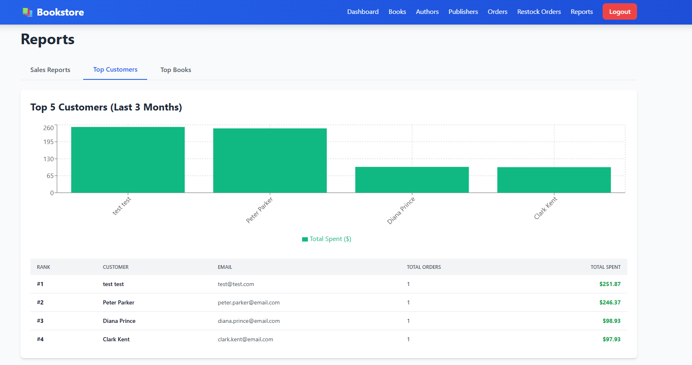
  - Ranked by total purchase amount
  - Customer name and email
  - Total orders
  - Total spent
  - Bar chart visualization
  - Detailed table view

#### Book Analytics

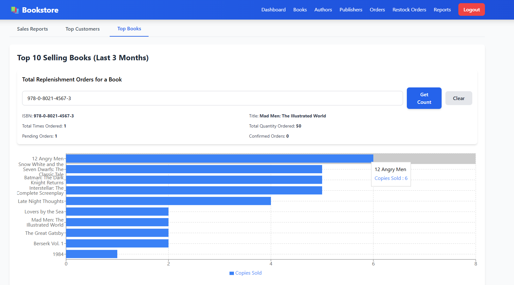

- ✅ **Top 10 Selling Books (Last 3 Months)**
  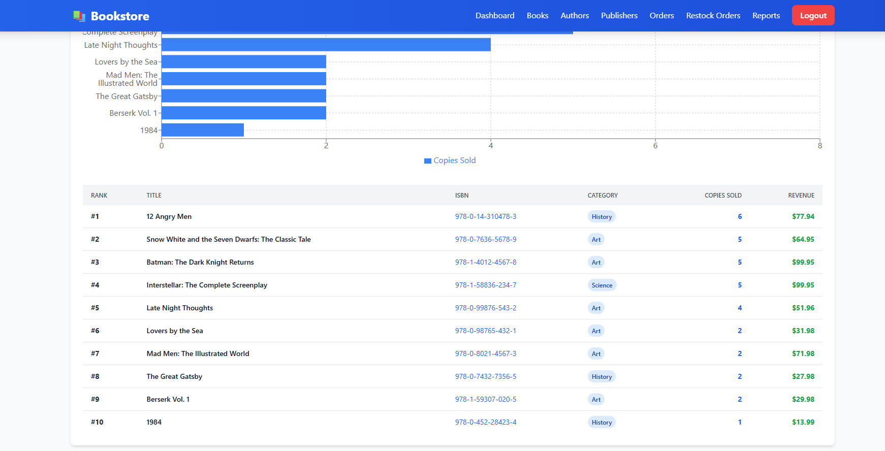

  - Ranked by copies sold
  - Book title, ISBN, category
  - Total copies sold
  - Total revenue
  - Horizontal bar chart
  - Color-coded categories

- ✅ **Book Replenishment Report**
  - Search by ISBN
  - Total times ordered from publisher
  - Total quantity ordered
  - Pending orders count
  - Confirmed orders count
  - Complete order history

---

### 📋 Order Management (Admin Only)

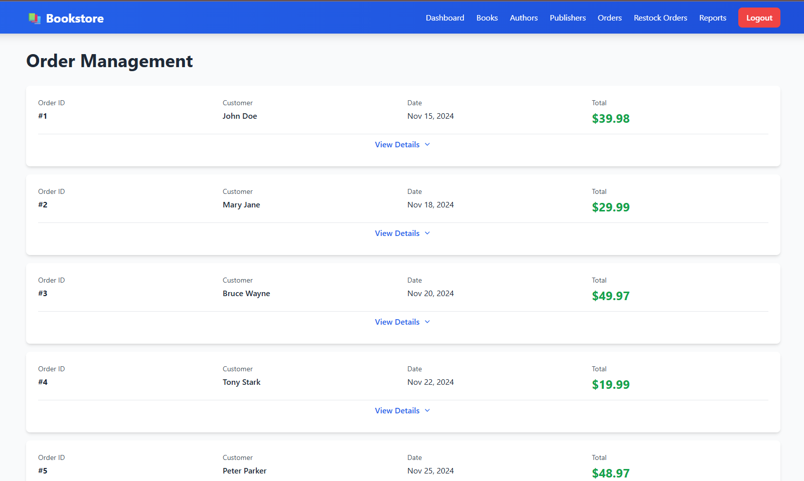

- ✅ **View All Customer Orders**

  - Order ID and customer name
  - Order date
  - Total amount
  - Expandable details

- ✅ **Order Details**

  - List of items in order
  - Quantity and unit price
  - Subtotal calculation
  - Customer information

- ✅ **Order Tracking**
  - Order status
  - Order history
  - Search and filter options

---

## 🚀 Installation & Setup

<a id="installation-setup"></a>

### Prerequisites

- Node.js 18+ and npm
- .NET 9.0 SDK
- SQL Server 2022
- Visual Studio 2022 or VS Code
- Git

### Backend Setup

1. **Clone the repository**

```bash
git clone https://github.com/yourusername/bookstore.git
cd OnlineBookStoreApi
```

2. **Restore NuGet packages**

```bash
dotnet restore
```

3. **Update database connection string**

Create in OnlineBookStoreApi Folder `appsettings.json`:

```json
{
  "ConnectionStrings": {
    "DefaultConnection": "Server=YOUR_SERVER;Database=Bookstore;Trusted_Connection=True;"
  }
}
```

4. **Create database**

Run the SQL script located in `/Database/Schema.sql`:

```sql
CREATE DATABASE Bookstore;
GO
USE Bookstore;
GO
-- Run all CREATE TABLE statements
-- Run all CREATE TRIGGER statements
```

5. **Seed sample data** (Optional)

Run `/Database/Seed Data.sql` to populate the database with test data.

6. **Run the API**

```bash
dotnet run
```

The API will be available at `https://localhost:7069`

### Frontend Setup

1. **Navigate to frontend directory**

```bash
cd ../bookstore-frontend
```

2. **Install dependencies**

```bash
npm install
```

3. **Configure environment variables**

Create `.env` file:

```env
REACT_APP_API_URL=https://localhost:7069/api
```

4. **Start development server**

```bash
npm start
```

The application will open at `http://localhost:3000`

### Default Admin Account

```
Username: admin
Password: admin123
```

---

## 📚 API Documentation

<a id="api-documentation"></a>

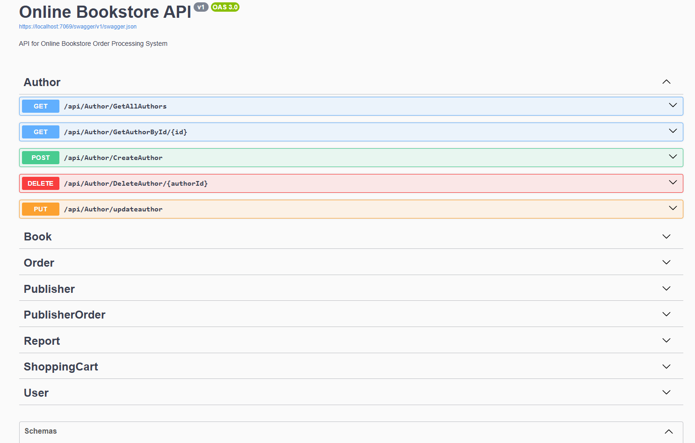

### Base URL

```
https://localhost:7069/api
```

### Authentication Endpoints

| Method | Endpoint                | Description           |
| ------ | ----------------------- | --------------------- |
| POST   | `/User/Register`        | Register new customer |
| POST   | `/User/Login`           | Login user            |
| POST   | `/User/Logout/{userId}` | Logout user           |

### Book Endpoints

| Method | Endpoint                              | Description                      |
| ------ | ------------------------------------- | -------------------------------- |
| GET    | `/Book/GetAllBooks`                   | Get all books                    |
| GET    | `/Book/GetBookByISBN/{isbn}`          | Get book by ISBN                 |
| GET    | `/Book/GetBooksByCategory/{category}` | Get books by category            |
| POST   | `/Book/SearchBooksAdvanced`           | Advanced search                  |
| POST   | `/Book/CreateBook`                    | Create book (Admin)              |
| PUT    | `/Book/UpdateBook`                    | Update book (Admin)              |
| DELETE | `/Book/DeleteBook/{isbn}`             | Delete book (Admin)              |
| POST   | `/Book/UploadBookPhoto`               | Upload book photo (Admin)        |
| POST   | `/Book/AddBookAuthors`                | Add authors to book (Admin)      |
| DELETE | `/Book/RemoveBookAuthors`             | Remove authors from book (Admin) |

### Cart Endpoints

| Method | Endpoint                               | Description               |
| ------ | -------------------------------------- | ------------------------- |
| GET    | `/ShoppingCart/GetCart/{customerId}`   | Get customer cart         |
| POST   | `/ShoppingCart/AddToCart`              | Add item to cart          |
| PUT    | `/ShoppingCart/UpdateCartItem`         | Update cart item quantity |
| DELETE | `/ShoppingCart/DeleteCart/{cartId}`    | Remove cart item          |
| DELETE | `/ShoppingCart/ClearCart/{customerId}` | Clear entire cart         |

### Order Endpoints

| Method | Endpoint                                  | Description            |
| ------ | ----------------------------------------- | ---------------------- |
| GET    | `/Order/GetAllOrders`                     | Get all orders (Admin) |
| GET    | `/Order/GetOrdersByCustomer/{customerId}` | Get customer orders    |
| GET    | `/Order/GetOrderDetails/{orderId}`        | Get order details      |
| POST   | `/Order/PlaceOrder`                       | Place new order        |

### Report Endpoints

| Method | Endpoint                                | Description                |
| ------ | --------------------------------------- | -------------------------- |
| GET    | `/Report/TotalSalesPreviousMonth`       | Previous month sales       |
| GET    | `/Report/TotalSalesForDate?date={date}` | Sales for specific date    |
| GET    | `/Report/Top5Customers`                 | Top 5 customers (3 months) |
| GET    | `/Report/Top10SellingBooks`             | Top 10 books (3 months)    |
| GET    | `/Report/BookOrderCount/{isbn}`         | Book reorder statistics    |

### Publisher Order Endpoints

| Method | Endpoint                                | Description                |
| ------ | --------------------------------------- | -------------------------- |
| GET    | `/PublisherOrder/GetAllPublisherOrders` | Get all orders (Admin)     |
| GET    | `/PublisherOrder/GetPendingOrders`      | Get pending orders (Admin) |
| POST   | `/PublisherOrder/CreatePublisherOrder`  | Create order (Admin)       |
| PUT    | `/PublisherOrder/ConfirmOrder`          | Confirm order (Admin)      |

## And More Check Them Out in the Controller !!!
